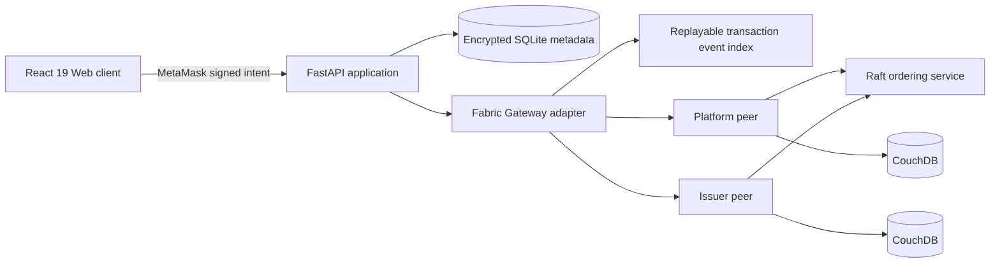

# Architecture

Production expands the ordering node in this logical diagram into three consenters:
`orderer`, `orderer2`, and `orderer3`. They share the governed Orderer MSP but use distinct
TLS identities and ledger volumes, tolerating one orderer crash while maintaining quorum.

The browser owns the Ethereum signing key. Fabric continues to use consortium
X.509 identities. Chaincode must validate the wallet-signed canonical intent
and the submitter's MSP/attributes before changing state.

Credential, wallet, sharing, trust, and transaction routes run through FastAPI and the
allow-listed Fabric adapter. MetaMask challenge verification and the provisioned wallet-to-actor
mapping are the normal authentication path. Express remains temporarily available only for
controlled migration and recovery compatibility. Domain decisions belong in chaincode or domain services, not
HTTP controllers or React components.

The adapter replays `CredentialTransaction` and filtered block events, projects real
transaction IDs and block numbers, and persists a sanitized JSONL audit index on a dedicated
volume. Valid credential events remain rebuildable from the immutable ledger. Invalid entries
contain only transaction ID, block, channel, and validation code—never attempted payloads.

Sensitive evidence locations never enter Fabric. The public credential record contains the
document hash and opaque metadata identifier; filename, provider, and storage location are
AES-256-GCM encrypted in SQLite with authenticated associated data. Only the holder and the
assigned issuer reviewer can request decryption.

The adapter accepts independent `SKILL_CHANNEL_NAME` and `TRUST_CHANNEL_NAME` values.
They default to the existing development channel, while production places credential and
trust/governance contexts on separate channels. See `SMART_CONTRACT_ENGINEERING.md` for
lifecycle, MSP, endorsement, indexing, payload, and migration controls.

## Trust boundaries

- MetaMask proves holder authorization, not issuer authority.
- Issuer X.509 identity, `synapsenet.actorId`/`synapsenet.role` certificate attributes, and
  peer endorsement prove issuer authority.
- Raft provides crash-fault-tolerant ordering, not protection from malicious
  credential approval.
- Challenge adjudication and issuer governance address malicious behavior.
- PostgreSQL is not used; SQLite is the approved MVP off-chain store.
