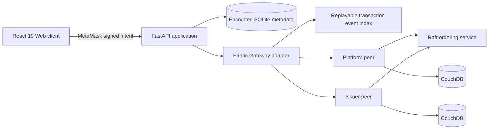

# Architecture

The browser owns the Ethereum signing key. Fabric continues to use consortium
X.509 identities. Chaincode must validate the wallet-signed canonical intent
and the submitter's MSP/attributes before changing state.

The compatibility Express gateway remains temporarily available while routes
move to FastAPI. Domain decisions belong in chaincode or domain services, not
HTTP controllers or React components.

The adapter replays `CredentialTransaction` chaincode events from the channel and
projects the real Fabric transaction ID and block number for the scanner API. The
projection can be rebuilt from the immutable ledger and is therefore not a second
system of record. Future webhook delivery should consume this same committed-event
stream after machine-to-machine authentication is introduced.

The adapter accepts independent `SKILL_CHANNEL_NAME` and `TRUST_CHANNEL_NAME` values.
They default to the existing development channel, while production places credential and
trust/governance contexts on separate channels. See `SMART_CONTRACT_ENGINEERING.md` for
lifecycle, MSP, endorsement, indexing, payload, and migration controls.

## Trust boundaries

- MetaMask proves holder authorization, not issuer authority.
- Issuer X.509 identity and peer endorsement prove issuer authority.
- Raft provides crash-fault-tolerant ordering, not protection from malicious
  credential approval.
- Challenge adjudication and issuer governance address malicious behavior.
- PostgreSQL is not used; SQLite is the approved MVP off-chain store.
