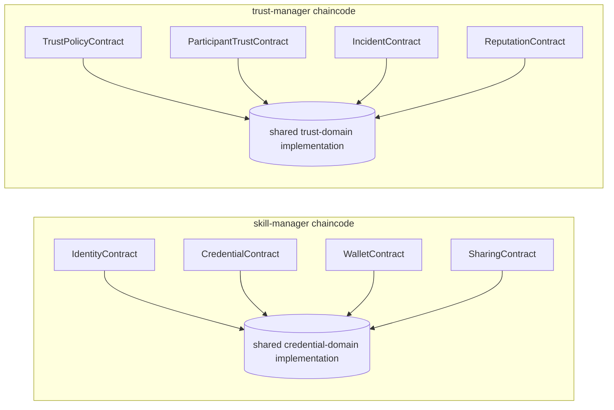
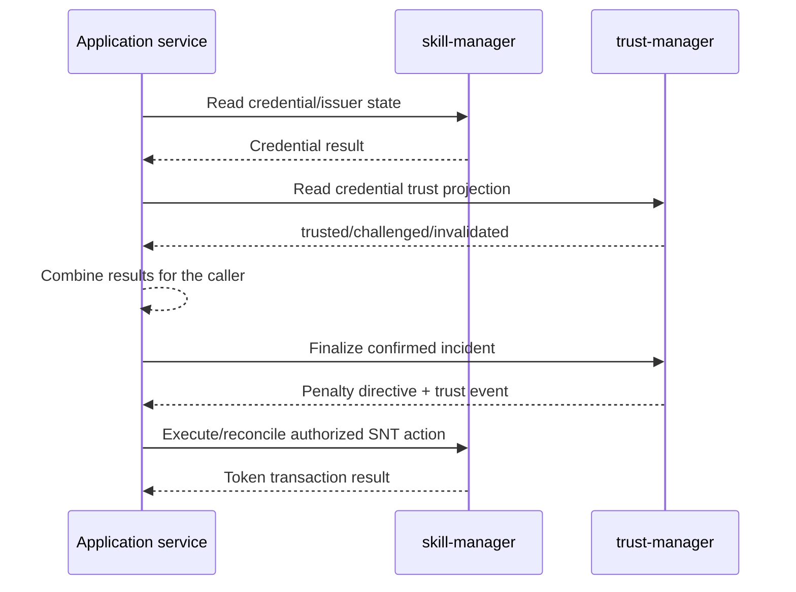

# SynapseNet Smart Contracts

SynapseNet builds two business-domain chaincodes as independent Chaincode-as-a-Service (CCaaS) packages. Each package contains several tightly coupled smart contracts.

| Chaincode/domain | Smart contracts | Package version | Lifecycle | Service |
|---|---|---:|---|---|
| `skill-manager` / credentials | `IdentityContract`, `CredentialContract`, `WalletContract`, `SharingContract` | `1.8.0` | version `1.8`, sequence `9` | `skill-manager:9999` |
| `trust-manager` / trust governance | `TrustPolicyContract`, `ParticipantTrustContract`, `IncidentContract`, `ReputationContract` | `1.5.0` | version `1.5`, sequence `6` | `trust-manager:9998` |

Both packages are TypeScript applications targeting Node.js. They default to the `synapsenet` channel, but channel and endorsement settings are independent: `CREDENTIAL_CHANNEL_NAME`, `TRUST_CHANNEL_NAME`, `CREDENTIAL_ENDORSEMENT_POLICY`, and `TRUST_ENDORSEMENT_POLICY`.

## Architecture and Relationship

```text
Web/API clients
      │
      ▼
Backend API Gateway / FastAPI
      │
      ▼
Fabric Adapter
      │
      ├── skill-manager ── credentials, evidence, wallets, shares, SNT accounting
      │
      └── trust-manager ── wallet identity, policy, reputation, incidents, penalties
```

The chaincodes are packaged, installed, approved, and committed separately. Peers maintain a separate world-state namespace for each chaincode, while smart contracts inside one package share that chaincode namespace. The packages do not call each other with `invokeChaincode`; application services coordinate them through explicit transactions and shared actor/credential IDs. This avoids cross-chaincode latency, partial-failure, and cross-channel consistency hazards.

This is intentionally two chaincodes—not one per contract. Credential identity, issuance, wallets, and sharing change together and share governance. Trust policy, participants, incidents, and reputation form a second cohesive domain with a distinct governance and upgrade boundary.

## How the Smart Contracts Interact

Smart contracts within a chaincode share its deployment lifecycle, endorsement policy, channel, and world-state namespace. They are separated at the Fabric API boundary, while common validation and persistence remain in one internal domain implementation. This avoids duplicating tightly coupled rules or making cross-chaincode calls for ordinary domain workflows.



Typical credential-domain interactions are:

1. `IdentityContract` registers a user or enterprise and creates the identity records required by later transactions.
2. `CredentialContract` validates those records when a holder submits a request and when an authorized enterprise reviewer approves it.
3. Approval writes the credential and wallet projection atomically within the `skill-manager` transaction.
4. `WalletContract` reads and refreshes wallet and SNT projections derived from credential-domain records.
5. `SharingContract` verifies credential ownership before creating a recipient-, purpose-, and time-bound disclosure grant.

Typical trust-domain interactions are:

1. `TrustPolicyContract` establishes the governance rules used throughout the domain.
2. `ParticipantTrustContract` binds an actor and MSP identity to a wallet-signed address.
3. `IncidentContract` reads participant and policy state while managing report, response, decision, appeal, and finalization stages.
4. `ReputationContract` applies policy-defined awards to participant reputation.
5. Final incident decisions update trust projections and create penalty directives inside the same `trust-manager` transaction.

These are logical contract interactions, not nested Fabric invocations. Each public contract delegates to the shared domain implementation and operates on the same chaincode state namespace.

## How the Chaincodes Interact

The two chaincodes do not directly invoke one another. The API gateway and Fabric adapter explicitly select the channel, chaincode, smart-contract namespace, and transaction. Application-level orchestration connects records using stable `actorId` and `credentialId` values.



This design has the following operational rules:

- Both chaincodes default to `synapsenet`, but each can be configured on a different channel.
- Each chaincode is packaged, installed, approved, committed, upgraded, and monitored independently.
- Each chaincode has its own endorsement policy and peer world-state namespace.
- Application orchestration is not an atomic transaction across chaincodes. Services must use idempotency, retry, reconciliation, and explicit partial-failure handling for multi-chaincode writes.
- Cross-channel workflows must be treated as application-level coordination; no assumption is made that one channel can atomically update another.
- A direct `invokeChaincode` dependency should be introduced only when its governance, performance, channel, and failure semantics have been reviewed. It is not part of the current design.

## Shared Technical Dependencies

| Dependency | Purpose |
|---|---|
| `fabric-contract-api` `^2.5.6` | Fabric contract and transaction programming model. |
| `fabric-shim` `^2.5.6` | Low-level communication with the Fabric peer. |
| `json-stringify-deterministic` `^1.0.12` | Deterministic JSON serialization for ledger values and signed payloads. |
| `sort-keys-recursive` `^2.0.0` | Recursively normalizes object key order before serialization. |
| TypeScript | Compiles contract source into the `dist` runtime entry point. |

`trust-manager` additionally depends on `ethers` `^6.15.0` to normalize Ethereum addresses and verify MetaMask-compatible signed messages.

## Credential Domain Chaincode (`skill-manager`)

Source: `blockchain/chaincode/skill-manager/src/skillManagerContract.ts`

The skill manager controls the verifiable-credential lifecycle, evidence references, enterprise approval, wallet projections, private disclosure grants, and initial SNT accounting.

| Smart contract | Fabric namespace | Owned transactions |
|---|---|---|
| Identity | `SynapseNet.IdentityContract` | `InitLedger`, participant and reviewer registration/listing |
| Credential | `SynapseNet.CredentialContract` | credential request, review, wallet credential views |
| Wallet | `SynapseNet.WalletContract` | wallet opening, account and token transaction views |
| Sharing | `SynapseNet.SharingContract` | selective share creation, revocation, and reads |

`SkillManagerContract` remains an internal domain implementation used by these public contracts and by unit tests; it is not registered as a callable Fabric contract.

### Ledger Records

| Record | Composite-key namespace | Purpose |
|---|---|---|
| User | `user` | Professional credential holder bound to the submitting MSP. |
| Enterprise | `enterprise` | Credential issuer and its authorized reviewer IDs. |
| Credential request | `credentialRequest` | Evidence-backed request in `pending_validation`, `approved`, or `rejected` state. |
| Credential | `credential` | Approved credential owned by a user and issued by an enterprise. |
| Share grant | `shareGrant` | Purpose-bound, recipient-bound, time-limited selective disclosure. |
| Wallet | `wallet` | User or enterprise credential projection and SNT balance totals. |
| Token transaction | `tokenTransaction` | Immutable SNT issuance, use, or burn accounting entry. |

Supported credential types are `skill`, `role`, `education`, `certificate`, and `other`.

Evidence documents stay off-ledger. The contract stores their filename, document type, storage provider/reference, and SHA-256 content hash. A transaction JSON payload is limited to 32 KiB.

### Write Transactions

| Transaction | Arguments | Behavior and authorization |
|---|---|---|
| `InitLedger` | none | Logs contract initialization; it does not seed domain records. |
| `registerUser` | `userId`, `displayName` | Creates an active user, binds its MSP to the submitting identity, opens a wallet, and issues the initial wallet token record. |
| `registerEnterprise` | `enterpriseId`, `name`, `initialReviewerId` | Creates an issuer under the submitting MSP, installs its first reviewer, and opens its wallet. |
| `addEnterpriseReviewer` | `enterpriseId`, `reviewerId` | Adds a reviewer ID to the enterprise reviewer set if it is not already present. |
| `submitCredentialRequest` | `payloadJSON` | Validates the holder, issuer, evidence hashes, credential details, and holder MSP before creating a pending request. Skill credentials receive additional field and evidence-type validation. |
| `reviewCredentialRequest` | `requestId`, `reviewerId`, `decision`, `notes` | Requires the issuer MSP and an enterprise-listed reviewer. Rejection finalizes the request; approval atomically creates the credential. |
| `createShareGrant` | `payloadJSON` | Confirms ownership and active status of every selected credential, validates the disclosure interval, and creates the grant. |
| `revokeShareGrant` | `shareId`, `ownerId` | Revokes a grant only when the supplied owner matches the recorded owner. |
| `openWallet` | `ownerId`, `ownerType` | Ensures a user or enterprise wallet exists and refreshes its owned/issued credential projections. |

### Read Transactions

| Transaction | Result |
|---|---|
| `getUsers` | All user records. |
| `getEnterprises` | All enterprise records. |
| `getCredentialRequests` | All credential requests. Application services must apply actor visibility rules. |
| `getWallet(userId)` | Credentials owned by the user. |
| `getWalletAccount(ownerId)` | Wallet totals plus refreshed owned and issued credential IDs. |
| `getTokenTransactions(ownerId)` | Token accounting entries for the owner. |
| `getIssuedCredentials(enterpriseId)` | Credentials issued by an enterprise. |
| `getShareGrant(shareId)` | Grant, referenced credentials, and current accessibility result. |
| `getSharedCredentials(recipientId)` | Grants addressed to a recipient, referenced credentials, and accessibility results. |

### Skill Credential Validation

Skill requests require:

- A proficiency level of `Beginner`, `Intermediate`, `Advanced`, or `Expert`.
- A non-empty practical-application description.
- One or more evidence records with an allowed document type.

Optional experience must be numeric and within the accepted range. Tools, attestations, and last-used month are bounded and validated. All evidence content hashes must be SHA-256 values.

### Events

| Event | Emitted when |
|---|---|
| `UserRegistered` | A professional user is created. |
| `EnterpriseRegistered` | An issuer enterprise is created. |
| `EnterpriseMemberAdded` | A reviewer is added. |
| `WalletOpened` | A wallet is first created. |
| `DummyTokensAllocated` | The development wallet receives its initial 1,000 SNT allocation. |
| `CredentialTransaction` | A credential request is submitted, approved, or rejected. |
| `ShareGrantCreated` | A selective disclosure grant is created. |
| `ShareGrantRevoked` | A disclosure grant is revoked. |

### CouchDB Indexes

| Index | Fields |
|---|---|
| `credentialIssuer` | `docType`, `issuerEnterpriseId`, `status`, `credentialType` |
| `credentialOwner` | `docType`, `ownerId`, `status`, `credentialType` |
| `credentialRequest` | `docType`, `userId`, `enterpriseId`, `status`, `credentialType` |

## Trust Domain Chaincode (`trust-manager`)

Sources: `blockchain/chaincode/trust-manager/src/trustManagerContract.ts` and `models.ts`

The trust manager links business actors to Ethereum-compatible wallets, controls governance policy, records misconduct proceedings, manages non-transferable reputation, and produces credential trust projections and token-penalty directives.

| Smart contract | Fabric namespace | Owned transactions |
|---|---|---|
| Trust policy | `SynapseNet.TrustPolicyContract` | initialize, activate, and read policy |
| Participant trust | `SynapseNet.ParticipantTrustContract` | register and read wallet-bound participants |
| Incident | `SynapseNet.IncidentContract` | report, respond, decide, appeal, finalize, and trust-status reads |
| Reputation | `SynapseNet.ReputationContract` | policy-governed reputation awards |

`TrustManagerContract` remains the internal domain implementation and is not registered as a callable Fabric contract.

### Ledger Records

| Record | Composite-key namespace | Purpose |
|---|---|---|
| Policy | `trustPolicy` | Immutable versioned governance, timing, reward, and penalty configuration. |
| Active policy pointer | `trustPolicyActive` | References the active policy version. |
| Participant | `trustParticipant` | User, enterprise, or reviewer identity with wallet, MSP, reputation, and status. |
| Wallet binding | `walletBinding` | Enforces one actor binding per normalized wallet address. |
| Signed-intent nonce | `intentNonce` | Prevents replay of a wallet-authorized action. |
| Misconduct incident | `misconductIncident` | Allegation, response, decision, appeal, and finality state. |
| Credential trust projection | `credentialTrustProjection` | `challenged`, `issuer_unresponsive`, `trusted`, or `invalidated` status for a credential. |
| Penalty directive | `penaltyDirective` | Pending instruction for application-level SNT burn execution. |
| Reputation award | `reputationAward` | Idempotency record for policy-controlled reputation awards. |

Participant statuses are `active`, `probation`, and `suspended`. Incident states are `reported`, `investigating`, `confirmed`, `dismissed`, `appealed`, `final`, and `issuer_unresponsive`.

### Write Transactions

| Transaction | Arguments | Behavior and authorization |
|---|---|---|
| `initializePolicy` | `policyJson` | Bootstraps the first policy. The submitter MSP must be included in the supplied governance MSP set. |
| `activatePolicy` | `policyJson` | Creates and activates a new immutable version; requires authorization under the currently active governance policy. |
| `registerParticipant` | `actorId`, `actorType`, `walletAddress`, `authoritativeMspId`, `intentJson`, `signature` | Requires the authoritative MSP and a matching wallet-signed intent. Enforces unique wallet binding. |
| `reportIncident` | `incidentJson`, `intentJson`, `signature` | Requires a registered reporter and a signed intent covering the complete incident payload. Creates a response deadline and challenges the credential when supplied. |
| `respondToIncident` | `incidentId`, `responseHash` | Only the accused participant's authoritative MSP may respond during the configured response window. |
| `decideIncident` | `incidentId`, `decision`, `reasonHash` | Governance confirms or dismisses an incident. Confirmation opens the appeal window; dismissal restores credential trust. |
| `appealIncident` | `incidentId`, `intentJson`, `signature` | Permits one wallet-signed appeal by the accused participant before the deadline. |
| `finalizeIncident` | `incidentId`, `finalDecision` | Governance finalizes after appeal or expiry. It may mark an issuer unresponsive, restore trust, or apply reputation/status changes and create a penalty directive. |
| `awardReputation` | `actorId`, `performanceType`, `referenceId` | Governance awards policy-defined REP. The actor/reference/type tuple prevents duplicate awards. |

### Read Transactions

| Transaction | Result |
|---|---|
| `getParticipant(actorId)` | Participant identity, reputation, incident count, and status. |
| `getIncident(incidentId)` | Complete incident state. |
| `getActivePolicy()` | Active governance policy. |
| `getCredentialTrustStatus(credentialId)` | Current credential trust projection. |

### Signed Intents

Wallet-authorized operations use a canonical deterministic JSON document containing:

- Domain `SynapseNet` and version `1`.
- Authorized action and actor ID.
- Normalized wallet address.
- SHA-256 hash of the complete transaction payload.
- Unique nonce.
- Ledger-time expiry.

The contract verifies the Ethereum signed message with `ethers.verifyMessage`, compares every authorization field, and records the nonce before completing the operation. This prevents parameter substitution, expiry bypass, and replay.

### Governance Policy

The policy defines:

- Governance MSP IDs.
- Three progressive SNT burn rates in basis points.
- Reputation rewards and penalties by named action.
- Issuer response and participant appeal windows.
- An immutable policy version used by each incident.

The development policy currently uses `Org1MSP`, burn rates of 10%, 25%, and 100%, and 14-day response and appeal windows.

Confirmed misconduct subtracts the configured reputation penalty. A participant enters `probation` after a confirmed incident and becomes `suspended` on the third. The contract writes a `pending_token_execution` directive instead of directly burning tokens in the other chaincode.

### Events

| Event | Emitted when |
|---|---|
| `TrustPolicyActivated` | A policy version becomes active. |
| `WalletIdentityLinked` | A participant and wallet are linked. |
| `MisconductReported` | A signed allegation is recorded. |
| `CredentialTrustStatusChanged` | A credential projection changes. |
| `IncidentResponseRecorded` | The authoritative MSP responds. |
| `MisconductConfirmedPendingAppeal` | Governance confirms an incident before finality. |
| `MisconductDismissed` | Governance dismisses an incident. |
| `IncidentAppealed` | The accused submits an appeal. |
| `IssuerUnresponsive` | The response deadline expires without a response. |
| `AppealResolved` | A final appeal decision dismisses an incident. |
| `MisconductConfirmed` | Confirmed misconduct becomes final. |
| `PenaltyDirected` | A progressive token-burn directive is created. |
| `ReputationAwarded` | Governance awards REP. |

### CouchDB Indexes

| Index | Fields |
|---|---|
| `incidentsByActor` | `docType`, `accusedActorId`, `status`, `policyVersion` |
| `participantsByStatus` | `docType`, `authoritativeMspId`, `status`, `actorType` |

## Build, Test, and Deployment

From the repository root:

```bash
yarn workspace skill-manager build
yarn workspace skill-manager test
yarn workspace trust-manager build
yarn workspace trust-manager test
```

Deployment scripts:

- `infrastructure/scripts/deploy-chaincode.sh` packages and commits `skill-manager`.
- `infrastructure/scripts/deploy-trust-chaincode.sh` builds, packages, and commits `trust-manager`.
- `blockchain/config/chaincode-versions.env` is the audited source for each domain's lifecycle version, sequence, channel, and endorsement policy.

Each script creates a CCaaS package containing `connection.json`, CouchDB metadata, and lifecycle metadata; installs it on the peer; starts its Docker service; approves it for the organization; and commits the definition to the channel.

## Tests

`skillManagerContract.test.js` covers onboarding, pending credential submission, reviewer authorization, credential issuance, wallet projections, initial SNT accounting, selective sharing, and malformed evidence hashes.

`trustManagerContract.test.js` covers signed wallet binding, nonce replay protection, governance authorization, immutable policy activation, progressive penalty directives, and suspension after a third confirmed incident.

## Current Integration Boundaries

- Evidence content is not uploaded to Fabric; only proofs and storage references are stored.
- Trust projections do not alter the source credential record in `skill-manager`.
- Penalty directives do not automatically burn SNT; an authorized integration must execute and reconcile them.
- Application services are responsible for applying actor-specific visibility rules to broad ledger queries.
- Lifecycle endorsement is configured per chaincode; every smart contract within that chaincode shares its policy.
- Application-level MSP checks serve a different purpose from endorsement and must remain enforced.
- Add a new chaincode only for a genuinely separate domain, governance policy, or upgrade/isolation requirement; otherwise add a smart contract to the existing domain package.
